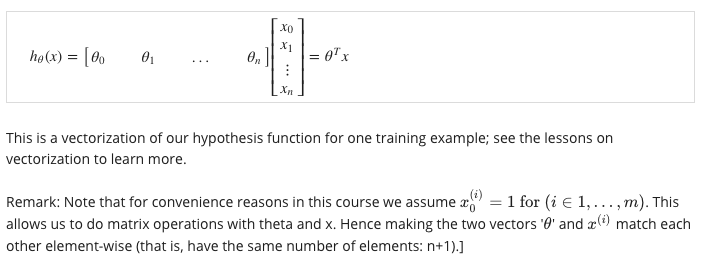

# Week 2

[toc]

# Multivariate Linear Regression

## Multiple Features

Linear regression with multiple variables is also known as "multivariate linear regression".

We now introduce notation for equations where we can have any number of input variables:


**m = the number of training examples.**

The multivariable form of the hypothesis function accommodating these multiple features is as follows:.

$hθ​(x)=θ0​+θ1​x1​+θ2​x2​+θ3​x3​+⋯+θn​xn$

In order to develop intution about this function, we can think about θ0 as the basic price of a house, θ2 as the price per floor, etc. x1 will be the number of square meters in the house, x2 the number of floors, etc.

Using the definition of matrix multiplicaiton, our multivariable hypothesis function can be concisely represented as:




## Gradient Descent for Multiple Variables

The gradient descent equation itself is generally the same form; we just have to repeat it for our 'n' features:


The following image compares gradient descent with  one variable to gradient descent with multiple variables:


## Gradient Descent in Practice I - Feature Scaling

We can speed up gradient descent by having each of our input values in roughly the same range. This is because θ will descend quickly on small ranges and slowly on large ranges, and so will oscillate efficiently down to the  optimum when the variables so that they are very uneven.

The Idea of Feature Scaling: Make sure features are on a similar scale.


**Feature Scaling:**

Get every feature into approximately a -1 ≤ xi ≤ 1 range.


small range difference is acceptable

**Mean normalization**


**The goal is to get all input variables into roughly one of these ranges, give or take a few.**

Two techniques to help with this feature scaling and mean normalization.

Feature scaling involves dividing the input values by the range of input variable, resulting in a new range of just 1.

Mean normalization involves subtracting the average value for an input variable from the values for that input variable resulting in a new average value for the input variable of just zero.


Purpose: 

Make gradient run much faster, and converge in a lot fewer on interactions.

## Gradient Descent in Practice II - Learning Rate

center around the learning rate alpha.

- **"Debugging":** How to make sure gradient descent is working correctly.

    Make a plot with number of iterations on the x-axis. Now plot the cost function, J(θ) over the number of iterations of gradient descent. If J(θ) ever increases, then you probably need to decrease a.

- How to choose learning rate alpha.

    **Automatic convergence test.** Declare convergence if j(θ) decreases by less than E in one iteration, where E is some small value as 10 ^ -3. However in practice it's difficult to choose this threshold value.


Summary:


## Features and polynomial regression

We can improve our features and the form of our hypothesis function in a couple different ways.

Purpose:

1. The choice of features that you have and how you can get different learning algorithm.
2. Polynomial regression: to fit very complicated, even non-linear functions.

Exp: **Housing prices prediction:**

two features: frontage and depth.

Particular problem depending on what insight you might have. We can combine multiple features into one. 


use frontage and depth or just one feature x = frontage * depth.

**Polynomial regression:**

Our hypothesis function need not be linear if that does not fit the data well.

**We can change the behavior of curve of our hypothesis function by making it a quadratic, cubic or square root function.**


One important thing to keep in mind is, if you choose your features this way then <u>feature scaling becomes very important.</u>

How do we actually fit a model to our data?


It's important to apply feature scaling if using gradient descent to get them into compareble ranges of values.

According to this section, you have a choice in what features to use, and by designing different features you can fit more complex functions your data then just fitting a straight line to the data and in particular you can put polynomial functions as well and sometimes by appropriate insight into the features simply get a much better model for your data.

# Computing Parameters Analytically

## Normal Equation

Normal Equation is another way of minimizing j.

A second way of doing so, this time performing the minimization explicitly and without resorting to an iterative algorithm.

In the "Normal Equation" method, we will minimize J by explicitly taking derivatives with respect to the the θj ’s, and setting them to zero. This allows  us to find the optimum theta without iteration. The normal equationo formula is given below:


There is no need to do feature scaling with the normal equation.


The following is a comparison of gradient descent and the normal equation.


- Octave:

```matlab
pinv(x' * x) * x' * y
```

## Normal  equation and non-invertibility(optional)

 When implementing the normal equaton in octave we want use the 'pinv' function rather than 'inv'. The 'pinv' function will give you a value of *θ* even if  $X^T * X$ is not invertible.

The reason $X^T * X$ is **noninvertible, the common cause might be having :**

- Redundant features, where two features are very closely related (i.e. they are linearly dependent)
- Too many features (e.g. m ≤ n). In this case, delete some features or use "regularization" (to be explained in a later lesson).

Consider about the non-invertible situation.


- delete some features.
- use regularization.

Review:


补充：Normal Equation 公式的推导