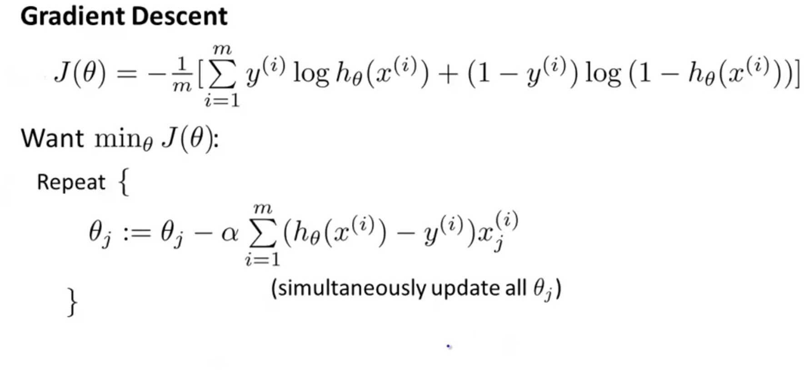

# Week3

[toc]

# Classification and Representation

## Classification

Explain why the linear regression is unsuitable for classification problems.

To attempt classification, one method is to use linear regression and map all predictions greater than 0.5 and all less than 0.5 as a 0. However, this method doesn't work well because classification is not actually a linear function.

Apply LinearRegression to a classification problem is not a great idea.

The classification problem is just like the regression problem, except that the values we now want to predict take on a small number of discrete values. For now, we will focus on the binary classification problem in which y can take on only two values, 0 and 1.

So we develop an algorithm called **Logistic Regression.** Which has the property the output of the predictions of regression are always between zero and one.

## Hypothesis Representation

 

**Summary**

Chinese：

Logistic 函数可以看成是一个“挤压”函数，把一个实数域的输入“挤压”到
(0, 1).当输入值在 0 附近时，Sigmoid 型函数近似为线性函数;当输入值靠近两端
时，对输入进行抑制.输入越小，越接近于 0;输入越大，越接近于 1.这样的特点
也和生物神经元类似，对一些输入会产生兴奋(输出为 1)，对另一些输入产生抑
制(输出为 0).和感知器使用的阶跃激活函数相比，Logistic 函数是连续可导的，
其数学性质更好.

因为 Logistic 函数的性质，使得装备了 Logistic 激活函数的神经元具有以下
两点性质:

1)其输出直接可以看作概率分布，使得神经网络可以更好地和统计学习模型进行结合.

2)其可以看作一个软性门(Soft Gate)，用来控制其他神经元输出信息的数量.

## Decision Boundary

Give us a better sense of what the logistic regressions hypothesis function is computing.

 

Non-linear decision boundaries

Summary

# Logistic Regression Model

## Cost Function

How do we fit the parameter's theta.

We can't use the same function that we use for linear regression because the Logistic Function will cause the output to be wavy[non-convex],causing many local optima. In other words, it will not be a convex function.

Logistic regression cost function 

quiz:

We cannot use the same cost function that we use for linear regression because the Logistic Function will cause the output to be wavy, causing many local optima. In other words, it will not be a convex function.

Instead, our cost function for logistic regression looks like:

If our correct answer 'y' is 0, then the cost function will be 0 if our hypothesis function also outputs 0. If our hypothesis approaches 1, then the cost function will approach infinity.

If our correct answer 'y' is 1, then the cost function will be 0 if our hypothesis function outputs 1. If our hypothesis approaches 0, then the cost function will approach infinity.

Note that writing the cost function in this way guarantees that J(θ) is convex for logistic regression.

## Simplified Cost Function and Gradient Descent

We can fully write out our entire cost function as follows:

Notice that this algorithm is identical to the one we used in linear regression. We still have to simultaneously update all values in theta.

## Advanced Optimization

Summary:

"Conjugate gradient", "BFGS", and "L-BFGS" are more sophisticated, faster ways to optimize θ that can be used instead of gradient descent. We suggest that you should not write these more sophisticated algorithms yourself (unless you are an expert in numerical computing) but use the libraries instead, as they're already tested and highly optimized. Octave provides them.

## Multiclass Classification: One-vs-all

How to get Logistic Regression to work for Multi-class classification: One-vs-all

Now we will approach the classification of data when we have more than two categories. Instead of y = {0, 1}, we will expend our defination so that y = {0, 1, 2...n}.

Since y = {0, 1... n} we divide our problem into n+1 (+1 because the index starts at 0) binary classification problems; in each one, we predict the probability that 'y' is a member of one of our classes.

# The Problem of Overfitting

Overfitting: **if we have too many features, the learned hypothesis may fit the training set very well, but fail to generalize to new examples(predict prices on new examples.**

Addressing overfitting:
1.Reduce number of features.

- Manually select which features to keep.
- Model selection algorithm

2.Regularization

- Keep all the features, but reduce magnitude \ values of parameters theta J.
- Works well when we have a lot of features, each of which contributes a bit to predicting y.

## Regularization Cost function

Summary 

If we have overfitting from our hypothesis function, we can reduce the weight that some of the terms in our function carry by increasing their cost.

Say we wnated to make the following function more quadratic[二次的]:

## Regularized linear regression

We can apply regularization to both linear regression and logistic regression. We will approach linear regression first.

**Gradient Descent:**

**Normal Equation**

## 🌟Regularized Logistic Regression

The regularized can help solve the overfitting problems.

We can regularize logistic regression in a similar way that we regularize linear regression. As a result, we can avoid overfitting. The following image shows how the regularized function represented by the blue line:

Quiz:

