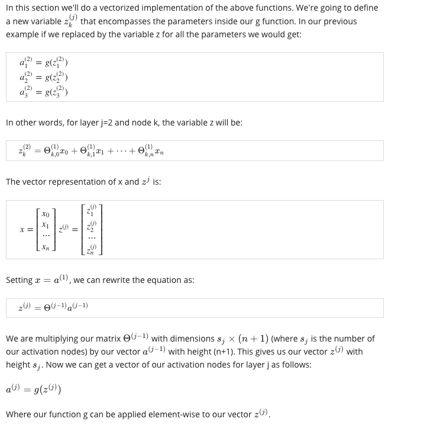

# Week4

# Neural Networks: Representation

## Model Represent I

Neuron model: Logistic unit
Our hypothesis output is the logistic function applied to the sum of the values of our activation nodes, which have been multiplied by yet another parameter matrix Θ(2) containing the weights for our second layer of nodes.

- Each layer gets its own matrix of weight.

## Model Representation II

Forward propagation: Vectorized implementation

To re-iterate, the following is an example of a neural network:

## Examples and Intuitions

Use neural net to implement AND, NOR and OR.

Then we have the XNOR operator using a hidden layer with two nodes. The following summarizes the above algorithms:

## Multiclass Classification

To classify data into multiple classes, we let our hypothesis function return a vector of values. Say we wanted to classify our data into one of four categories. We will use the following example to see how this classification is done. This algorithm takes as input an image and classifies it accordingly:

## Quiz

1.

A and D

B: every input x has the chance to output 1.

C: at least 3 layer.

2.

A

3.

A

4.

A

5.

A.