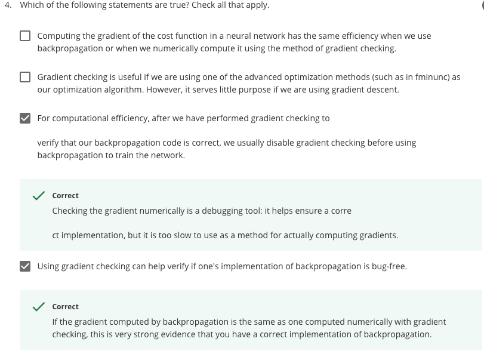

# Week5

[toc]

# Cost Function


# Backpropagation Algorithms

"Backpropagation" is neural-network terminology for minimizing our cost function, just like what we were doing with gradient descent in logistic and linear regression. 

Our goal is to compute:


We use following algorithms to achieve our goals.


## Intuition


# Implementation

## Unrolling


## Gradient Checking

Assure out backpropagation works as intended.


```matlab
epsilon = 1e-4;
for i = 1:n,
  thetaPlus = theta;
  thetaPlus(i) += epsilon;
  thetaMinus = theta;
  thetaMinus(i) -= epsilon;
  gradApprox(i) = (J(thetaPlus) - J(thetaMinus))/(2*epsilon)
end;
```

## Random Initialization

Initializing all theta weights to zero does not work with neural networks. When we backpropagate, all nodes will update to the same value repeatedly. Instead we can randomly initialize our weights for our $Θ$ matrices using the following method.


Implementation Note:

- Implement backprop to compute DVec
- Implement numerical gradient check to compute gradApprox.
- Make sure they give similar values.
- turn off gradient checking. Using backprop code for learning.

## Put all together


When we perform forward and back propagation, we loop on every training example:

```matlab
for i = 1:m,
   Perform forward propagation and backpropagation using example (x(i),y(i))
   (Get activations a(l) and delta terms d(l) for l = 2,...,L
```


# Quiz

1.


根据反向传播的向量公式即可。


2.


3.


4.



5. 


Choose B and C.


Reference：

[神经网络15分钟入门！--反向传播到底是怎么传播的？](https://zhuanlan.zhihu.com/p/66534632)