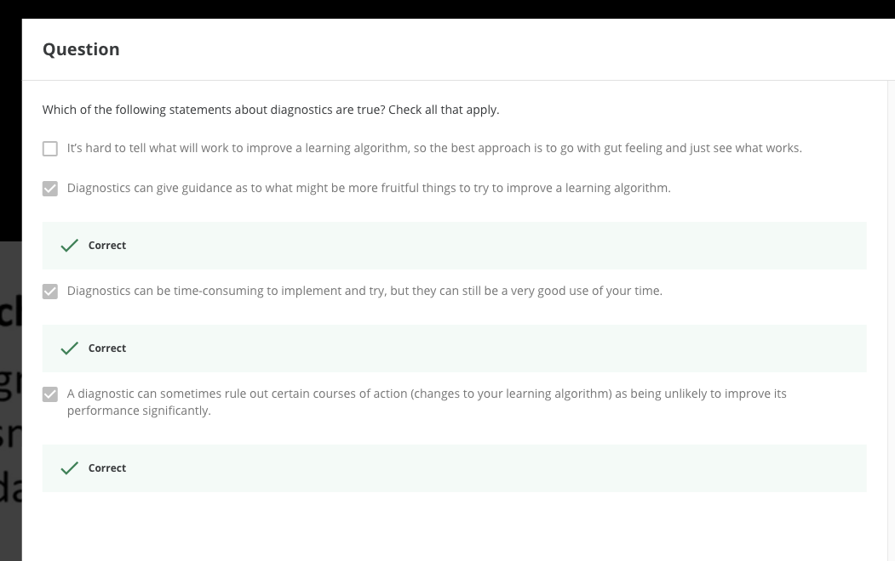

# Week6

[toc]

# Overview

How to systematically improving our learning algorithm. 

how to tell when a learning algorithms is doing poorly, and describe the 'best practices' for how to 'debug' your learning algorithm and go about improving its performance.

Also covering machine learning system design. To optimize a machine learning algorithm, you will need to first understand the performance of machine learning system with multiple parts, and also how to deal with skewed data.

# Evaluating a Learning hypothesis

**What's Machine learning diagnostic:**

Diagnostic: A test that you can run to gain insight what is/isn't working with a learning algorithms, and gain guidance as to how best to improve its performance.

Diagnostics can take time to implement, but doing so can be a very good use of your time.

A hypothesis may have a low error for the training examples but still be inaccurate (because of overfitting). Thus, to evaluate a hypothesis, given a dataset of training examples, we can split up the data into two sets: a **training set** and a **test set**. Typically, the training set consists of 70 % of your data and the test set is the remaining 30 %.

The new procedure using these two sets is then:

1. Learn $\Theta$  and minimize $J_{train}(\Theta)$ using the training set
2. Compute the test set error $J_{test}(\Theta)$

## The test set error

1. For linear regression: $J_{test}(\Theta) = \frac{1}{2m_{test}}\sum_{i=1}^{2m_{test}}(h_{\Theta}(x_{test}^{(i)})-y_{test}^{(i)})^2$
2. For classification ~ Misclassification error (aka 0/1 misclassification error):

$err(h\Theta(x),y) = \begin{cases}
 & \text 1 : {if}\,h_{\Theta} \geq0.5\,and\,h_{\Theta}\,\leq\,0.5\,and\,y\,=\,1  \\  
 & \text 0 :\,otherwise
\end{cases}$

This gives us a binary 0 or 1 error result based on a misclassification. The average test error for the test set is:

$Test\,Error = \frac{1}{m_{test}}\sum^{m_{test}}_{i=1}err(h_{\Theta}(x_{test}^{(i)},y_{test}^{(i)})$

This gives us the proportion of the test data that was misclassified.

Question:

## Model Selection and Train/Validation/test sets

- A learning algorithm fits a training set well, that does not mean it's a good hypothesis. It could over fit and as a result your predictions on the test set would be poor. The error of your hypothesis as measured on the data set with which trained the parameters will be lower than the error on any other data set.
- How to systematic approach to identify the 'best' function between many models with different polynomial degrees. You can test each degree of polynomial and look at the error result.
- One way to break down our dataset into the three sets is :
    - Training set: 60%
    - Cross validation set: 20%
    - Test set: 20%
- **We can calculate three separate error values for the three different sets using the following method:**
    - Optimize the parameters in $\Theta$ using the training set for each polynomial degree.
    - Find the polynomial degree d with the least error using the cross validation set.
    - Estimate the generalization error using the test set with $J(\Theta^{d})$,(d = theta from polynomial with lower error);

This way, the degree of the polynomial d has not been training using the test set.

Question:

# Bias vs. Variance[key]

## Diagnosing Bias vs. Variance

if you run a learning algorithms and it doesn't do as your hoping, it will because you have either a high bias problem or a high variance problem.[underfiting or overfiting]

This section we examine the relationship between the degree of the polynomial d and the underfitting of our hypothesis.

- We need to distinguish whether bias or variance is the problem contributing to bas predictions.
- **High bias is underfitting and high variance is overfitting**. Ideally, we need to find a golden mean between these two.

The training error will tend to decrease as we increase the degree d of the polynomial.

At the same time, the cross validation error will tend to decrease as we increase d up to a point, and then it will increase as d is increased.

**High bias(underfitting)**:  both $J_{train}(\Theta)$  and $J_{CV}(\Theta)$  will be high. Also, $J_{CV}(\Theta)  \approx J_{train}(\Theta)$

**High variance(overfitting)**: $J_{train}(\Theta)$  will be low and $J_{CV}(\Theta)$  will be much greater than $J_{train}(\Theta)$。

Summarized in figure below:

Question:

Exp: The cross-validation error is much greater than train validation.

## Regularization and Bias/Variance

Note: This section will go deeper into bias and variances. also talk about how it interacts with and is affected by the regularization of learning algorithm.

**As $\lambda$ increases, our fit becomes more rigid. As $\lambda$ approaches 0, we tend to overfit the data.** 

The point is: how do we choose our parameter $\lambda$ to get it 'just right'.

1. Create a list of lambdas (i.e. λ∈{0,0.01,0.02,0.04,0.08,0.16,0.32,0.64,1.28,2.56,5.12,10.24});
2. Create a set of models with different degrees or any other variants.
3. Iterate through the $\lambda$  s and for each $\lambda$   go through all the models to learn some $\Theta$.
4. Compute the cross validation error using the learned Θ (computed with λ) on the $J_{CV}(\Theta)$**without** regularization or $\lambda$  = 0.
5. Select the best combo that produces the lowest error on the cross validation set.
6. Using the best combo Θ and λ, apply it on $J_{test}(\Theta)$ to see if it has a good generalization of the problem.

## Learning Curves

**Learning curves** is often a very useful thing to plot. If either want to sanity check that you algorithm is working correctly. or if you want to improve the performance of algorithm.

Also, learning curves is a tool to diagnose if a physical learning algorithms maybe suffering from bias, sort of variance problem or a bit of both.

Training an algorithm on a very few number of data points will easily have 0 errors because we can always find quadratic curve that touches exactly those number of points. Hence:

- As the training set gets larger, the error for a quadratic function increases.
- The error value will plateau out after a certain m, or training set size.

Experiencing high bias:

**Low training set size**: causes $J_{train}(\Theta)$ to be low and J_{CV} to be high.

**Large training set size**: causes both $J_{train}(\Theta)$ and $J_{CV}(\Theta)$ to be high with $J_{train}(\Theta) \approx J_{CV}(\Theta)$ .

- if  a learning algorithm is suffering from high bias, getting more training data will not help much.]

**Experiencing high variance:**

**Low training set size**: $J_{train}(\Theta)$ will be low and $J_{CV}(\Theta)$ will be high.

**Large training set size**: $J_{train}(\Theta)$ increases with training set size and $J_{CV}(\Theta)$ continues to decrease without leveling off. Also, $J_{train}(\Theta)$ < $J_{CV}(\Theta)$ but the difference between them remains significant.

- If a learning algorithm is suffering from **high variance**, getting more training data is likely to help.

Question:

## Deciding What to Do Next Revisited

Our decision process can be broken down as follows:

- **Getting more training examples:** Fixes high variance
- **Trying smaller sets of features:** Fixes high variance
- **Adding features:** Fixes high bias
- **Adding polynomial features:** Fixes high bias
- **Decreasing λ:** Fixes high bias
- **Increasing λ:** Fixes high variance.

Diagnosing Neural Networks 

- A neural network with fewer parameters is prone to underfitting. It's also **computationally cheaper.**
- A large neural network with more parameters is prone to overfitting. It's also **computationally expensive**. In this case you can use regularization (Increase $\lambda$ ) to address the overfitting.

Using a single hidden layer is a good starting default. You can train your neural network on a number of hidden layers using your cross validation set. You can then select the one that performs best.

Model Complexity Effects:

- Lower-order polynomials (low model complexity) have high bias and low variance. In this case, the model fits poorly consistently.
- Higher-order polynomials (high model complexity) fit the training data extremely well and the test data extremely poorly. These have low bias on the training data, but very high variance.
- In reality, we would want to choose a model somewhere in between, that can generalize well but also fits the data reasonably well.

# Quiz - Advice for applying Machine Learning

# * Build a Spam Classifier

This video will touch on the main issues that you may face when designing a complex machine learning system.

Prioritizing What to Work ON

Error Analysis 

 

# Quiz: Machine Learning System Design

[Coursera: Machine Learning (Week 6) Quiz - Machine Learning System Design | Andrew NG](https://www.apdaga.com/2019/11/coursera-machine-learning-week-6-quiz-machine-learning-system-design.html)

**NOTE:**

**Accuracy** = (85 + 10) / (1000) = 0.095

**Precision** = (85) / (85 + 890) = 0.087

**Recall** = There are 85 true positives and 15 false negatives, so recall is 85 / (85 + 15) = 0.85.

**F1 Score** = (2 * (0.087 * 0.85)) / (0.087 + 0.85) = 0.16

# Summary with Chinese

中文整理：

神经网络与深度学习：偏差与方差

为了避免过拟合，我们需要在拟合能力和复杂度之间权衡。拟合能力强的模型一般复杂度比较高，容易过拟合。相反，如果限制模型复杂度，会降低拟合能力，可能导致欠拟合。因此，在模型拟合能力和复杂度之间取得一个较好的平衡，对于一个机器学习算法来说非常重要。

概念：

偏差（Bias）：指一个模型在不同训练集上的平均性能和最优模型的差异，**用来衡量一个模型的拟合能力。**

方差（Variance）：指一个模型在不同训练集上的差异，**用来衡量一个模型是否容易过拟合**，即泛化能力。

机器学习模型中一般包含以下四种偏差和方差的组合情况。每个图中心点为最优模型。

(a)图给出一种理想情况，偏差和方差都相对比较低。

(b)图为高偏差低方差的情况，表示泛化能力很好，但拟合能力不足。

(c)图为低偏差高方差的情况，表示模型拟合能力很好，但泛化能力不足，当训练数据较少时，容易过拟合。

(d)图表示高偏差高方差，是最差的情况。

方差一般会随着训练样本的增加而减少。样本较多时，方差比较小，这时候可以选择能力强的模型来减少偏差。

随着模型复杂度增加，模型的拟合能力变强，偏差减少而方差增大，从而导致过拟合。以结构风险最小化为例，我们可以调整正则化系数 $\lambda$ 来控制模型的复杂度。

- 当 $\lambda$ 变大时，模型复杂度会降低，可以有效减少方差，避免过拟合，但偏差会升高。
- 当 $\lambda$ 过大时，总的期望错误反而会上升，因此，一个好的正则化系数 $\lambda$  需要在偏差和方差之间取得比较好的平衡。

因此，一个好的正则化系数 $\lambda$   需要在偏差和方差之间取得比较好的平衡。下图给出来机器学习模型期望错误、偏差和方差随复杂度的变化情况，其中红色虚线表示最优模型，最优模型并不一定是偏差曲线和方差曲线的交点。

偏差和方差分解给机器学习模型提供了一种分析途径，但在实际操作中难以直接衡量。

一个模型在训练集上错误率比较高时，说明模型的拟合能力不够，偏差比较高。一般通过以下方式进行改进：

- 增加数据特征
- 提高模型复杂度
- 减小正则化系数
- 尝试多项式特征【Adding polynomial features】
- 集成模型【通过多个高方差模型的平均来降低方差】

当模型在训练集上错误率比较低，但验证集上错误率比较高时，说明模型过拟合，方差比较高，一般通过以下方式进行改进：

- 降低模型复杂度
- 加大正则化系数
- 引入先验