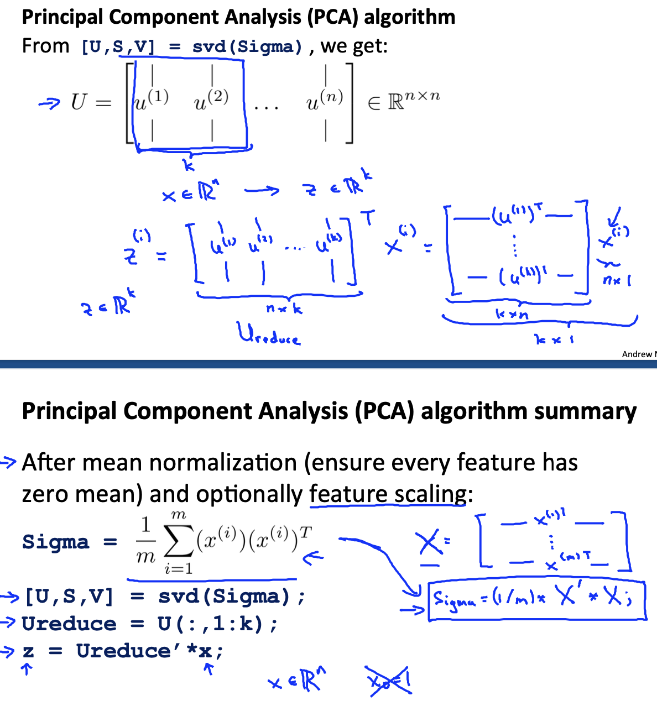

# Week8 

[toc]

节选自《神经网络与深度学习》第九章：无监督学习

无监督学习（Unsupervised Learning，UL）是指从无标签的数据中学习处一些有用的模式。无监督学习算法一般直接从原始数据中学习，不借助任何人工给出标签或者反馈等指导信息。如果监督学习是建立在输入-输出之间的映射关系，那么无监督学习就是发现隐藏数据中的有价值信息，包括有效特征、类别、结构以及概率分布等。

典型的无监督学习分类：

- 无监督特征学习（Unsupervised Feature Learning）是从无标签的训练数据中挖掘有效的特征或表示。无监督特征学习一般用来进行降维、数据可视化或监督学习前期的数据预处理。
- 概率密度估计（Probabilistic Density Estimation）简称**密度估计**，是根据一组训练样本来估计样本空间的概率密度。密度估计可以分为参数密度估计和非参数密度估计。
    - 参数密度估计用假设数据服从某个已知概率密度函数形成的分布（如高斯分布），然后根据训练样本去估计概率密度函数的参数。非参数密度估计是不假设数据服从某个已知分布，只利用训练样本对密度进行估计，可以进行任意形状密度的估计。非参数密度估计的方法只有直方图。
    - 聚类（Clustering）是将一组样本根据一定的准则划分到不同的组（也称为簇（Cluster））。一个比较通用的准则是组内样本的相似性要高于组间样本 的相似性.常见的聚类算法包括 K-Means 算法、谱聚类等。

和监督学习一样，无监督学习方法也包含三个基本要素:模型、学习准则和 优化算法.无监督学习的准则非常多，比如最大似然估计、最小重构错误等.在无 监督特征学习中，经常使用的准则为最小化重构错误，同时也经常对特征进行一 些约束，比如独立性、非负性或稀释性等.而在密度估计中，经常采用最大似然估计计来进行学习.

# Unsupervised Learning introduction

## K-means Algorithms

Input:

- K (number of clusters)
- Training set. {$x^{1},x^{2},...,x^{m}$}    $x^{i} \varepsilon  \mathbb{R}^{n}$ (Drop $x_{0} = 1$  convention)

[K-Means聚类算法原理](https://www.cnblogs.com/pinard/p/6164214.html)

Goal：Minimize squared error

Repeat the following steps:

## Optimization Objective

## Random initialization

Done the whole procedure a hundred times. You will have a hundred different ways of clustering the data, pick one give the lowest cost.

## Choosing the Number of clusters

## Quiz: Unsupervised Learning

# PCA（Principal Component Analysis）

主成分分析，是一种最常用的数据将维方法，使得在转换后的空间中数据的方差最大。

本章难度较大，涉及数学知识较广，参考相关文章。

[PCA主成分分析学习总结](https://zhuanlan.zhihu.com/p/32412043)

## Choosing the number of principal components

## Advice for applying PCA

## Quiz: Principle Component Analysis

